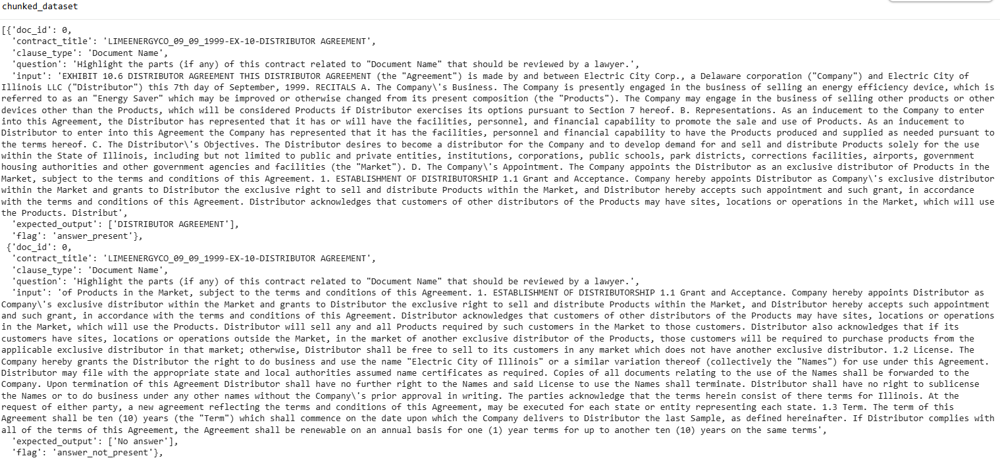
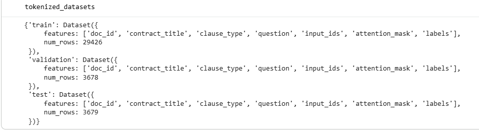

# Legal Clause Extraction from Contracts Using Text Generation Models

Automated extraction of legally significant clauses from long commercial contracts using transformer-based generative language models.  
This project reframes the traditional **span detection task** used in legal NLP into a **text generation problem**, allowing models to produce complete clause spans directly from contract text.

---

## Introduction

Legal contracts contain critical provisions such as termination rights, liability limits, governing law, and renewal terms; that must often be manually identified during legal review. Because contracts are typically long, densely written, and structurally inconsistent, locating these clauses requires significant time and expertise.

Traditional legal NLP approaches treat clause extraction as a **span detection problem**, where models attempt to locate the start and end indices of relevant text. However, this approach can struggle with long documents, fragmented clause spans, and variations in legal phrasing.

This project explores an alternative approach: **reframing clause extraction as a text generation task** using modern transformer-based models. Instead of predicting span boundaries, models generate the clause text directly when given a question and relevant contract context.

The study evaluates three generative architectures:

- **T5 Baseline** - establishes a reference performance for clause extraction using a standard sequence-to-sequence model.
- **FLAN-T5** - an instruction-tuned model that improves prompt understanding and clause generation accuracy.
- **BART Fusion** - a hybrid architecture that combines chunk-level representations using a fusion layer and classification head to improve clause detection across document segments.

Together, these models are evaluated to determine how well generative transformers can identify and reconstruct legal clauses from **long, unstructured contract documents**.
---

# Data & Preprocessing

### Contract Understanding Atticus Dataset (CUAD)
This study uses the **Contract Understanding Atticus Dataset (CUAD)**, which consists of: 
- 510 commercial legal contracts annotated by legal experts with over 13,000 labeled clauses spanning 41 legal categories such as "Governing Law," "Termination for Convenience," and "Confidentiality." 
- Contracts vary significantly in length (from 7 to over 150 pages), with word counts ranging from 8,000 to over 36,000 words per document. 
- Labeled clauses make up only 10% of each contract; given 41 categories, this means roughly 0.25% of the text is relevant per clause type, creating a highly sparse signal for models to learn from. 
- CUAD provides `answer_start` positions but not `answer_end`, and answers for a single question may appear in multiple, non-contiguous spans; highlighting a structural limitation of extractive approaches. 

This issue is addressed this by framing clause extraction as a text generation task, training models to produce the full clause text directly based on the contract and the legal category prompt. This study mainly focused on the labeled clauses heavily under sampling questions with no answers within CUAD, framing the clause extraction task as a text generation problem. 

## Preprocessing
### Data Set Restructuring and Preprocessing
Given the substantial length and variability of CUAD contracts (some exceeding 36,000 words), a chunking-based strategy was adopted to manage input size while preserving legal clause integrity. My initial approach divided contracts into fixed 512-token chunks, assigning each question only to the first chunk. This setup led to limited question exposure across the document and ultimately poor performance, as much of the text was processed without any associated prompt or clause relevance signal. 

To address this, we implemented a revised preprocessing pipeline inspired by the method proposed in Party Extraction from Legal Contracts Using Contextualized Span Representations (Sivapiran et al., 2023). In this setup, contracts are divided into overlapping 512-token chunks using a 256-token sliding window. Each chunk is paired with a clause-type-specific question, and a binary flag is used to indicate whether the answer is present in that chunk. When no relevant clause is found, the target is set to a consistent placeholder (“No answer”), which proved more stable than alternative fillers during experimentation. 

This expanded the dataset from 510 documents to 270,330 chunk-level examples. Instead of assigning all 41 clause‑type questions to a single document instance, each contract was replicated once per question, and each of these document–question pairs was then divided into overlapping chunks. So every question was paired with every chunk from it's corresponding document. A document id was used to identify which chunk belonged to which document. This doc_id will be used later for document level aggregation during evaluation. 

**Improved Chunked Dataset; with Binary Flag, Question Input and Expected Output**

- `clause_type`, `contract_title`, `doc_id`: metadata; useful for for aggregation and are not fed into the model. question`: clause that needs to be extracted. 
- `question` , `input`: This is model input
- `expected_output`: Target: what the model is to predict. 
- The `binary_flag`: detects whether the answer presence for the clause question. used for sampling/evaluation. Not fed into the model. 

This restructuring also led to a highly imbalanced dataset, with a large majority of chunks lacking relevant content (248,260 “no answer” vs. 22,070 “answer present”). To mitigate this, we under sampled “no answer” examples to constitute 40% of the training data, a ratio that offered the best downstream performance among the configurations we tried.

The resulting dataset consists of question-context-answer triplets, each representing a localized view of the contract. Each example includes the document ID, contract title, clause type, a natural language question, the input chunk of contract text, the expected output (i.e., clause text or a placeholder), and a binary flag for answer presence. An illustrative example is shown below:

**Distribution of Unbalance Dataset After Chunking - CHANGE IMAGE**

PENDING IMAGE
**Distribution of Final Dataset After a 40% Downsample of `answer_not_present` flags**

PENDING IMAGE
#### Data Split
The final dataset was split into 80% training (29,426 examples), 10% validation (3,678 examples), and 10% test (3,679 examples), using a fixed random seed to ensure reproducibility.

### Prompt Construction

---

# Modeling

## 1. T-5 Small As Baseline
- Model: - `t5-small`, Tokenizer:  t5 tokenizer, Max sequence length=512 tokens
- Dynamic padding: via `DataCollatorForSeq2Seq`
Inputs and outputs are tokenized separately and padded/truncated to 512 tokens.

### Limitations
- T5‑small frequently defaults to “No answer”, even when relevant clauses are present.
- Struggles with long entity spans (e.g., Parties).
- Performs better on formulaic clauses (e.g., Governing Law).
- Often identifies that an answer exists but fails to generate the correct span.
These limitations motivate the use of instruction‑tuned models (e.g., FLAN‑T5) and hybrid classification‑generation approaches.

## 2. FLAN5
The initial baseline used T5‑small to frame clause extraction as a conditional generation task over chunk–question pairs. While simple and fast to train, this model showed two consistent limitations:
- It frequently defaulted to “No answer”, even when relevant clauses were present.
- It struggled with long‑range dependencies and clause types with subtle or abstract phrasing.

To address these issues, we transitioned to FLAN‑T5‑base, an instruction‑tuned variant of T5 that is better aligned with extraction‑style generation tasks. We kept the same chunk–question–answer structure but added an explicit instruction prompt (e.g., “Only extract the clause if it exists, otherwise respond with ‘No answer.’”) to guide clause‑specific behavior.
Because the prompt reduces the effective chunk size during preprocessing, the FLAN‑T5 pipeline produces more chunk–question pairs, resulting in a final dataset of approximately 48,701 examples. This expanded set allows the model to see more localized contexts and improves its ability to recover clause spans that T5‑small often missed.

### FLAN-T5 Improvements over Baseline

Compared with the **T5 baseline**, the **FLAN-T5-base model** demonstrated several improvements in clause extraction quality:

- **Improved Clause Fidelity:** Generated clauses more closely matched the wording and structure of the original contract text.

- **Better Abstention Behavior:** The model was more likely to avoid generating an answer when a clause was not present in the context, reducing false positives.

- **Improved Prompt Understanding:**  Instruction tuning helped the model interpret clause-related questions more accurately.

- **More Structured Outputs:** Generated clauses were generally more coherent and closer to full clause spans rather than fragmented phrases.

### Limitations (FLAN-T5)
While **FLAN-T5-base** improved upon the **T5 baseline**—particularly in clause fidelity, abstention behavior, and structural fluency—it still exhibited several consistent limitations:

- **Incorrect Clause Anchoring:** The model occasionally generated clauses that were legally plausible but unrelated to the prompt (e.g., returning an IP assignment clause when asked about usage rights).

- **Sensitivity to Distractor Text:** In long or entity-dense sections, the model sometimes latched onto prominent terms and produced irrelevant outputs (e.g., generating an organization name unrelated to the question).

- **Chunk Fragmentation:** When clauses spanned multiple chunks, the model often returned partial or incomplete clause segments.

- **Hallucination Under Ambiguity:** For clause types with weak signals (e.g., *Parties*), the model occasionally fabricated entities or defaulted to header text.

- **Clause-Type Confusion:** Similar legal phrasing across clauses (e.g., *Termination*, *Renewal*, *Expiration*) sometimes caused the model to extract the wrong clause.

- **Limited Cross-Chunk Reasoning:** The model struggled to connect information spread across multiple chunks, leading to missed or incomplete answers.

These limitations highlight common challenges in **legal NLP**, particularly:

- clause boundary detection  
- entity normalization  
- reasoning across long structured documents

## 3. BART Fusion Model (Context Fusion + Classification Layer)
The third model in our pipeline is a **BART-based fusion architecture** designed to reduce the clause fragmentation issues seen in earlier models. Instead of treating each chunk independently, this model combines information across chunks to form a more complete document-level view.

### How it works

- Each chunk is paired with the question and encoded using BART.
- The first token representation is extracted from each chunk (similar to a `[CLS]` embedding).
- These chunk-level embeddings are fed into a lightweight **bidirectional LSTM**, which fuses context across the document.
- The fused representation is used in two ways:
  - a **generation head** to produce the clause text  
  - a **classification layer** to predict whether the answer exists in the chunk

An **LSTM for fusion** was selected because documents typically contain fewer than **10 chunks**, making it efficient and stable. Transformer-based fusion was tested but offered no meaningful improvement.

---

### Why BART was used

BART is strong at **text generation** and has been used in related tasks like **BARTScore** and **legal QA benchmarks**. While it is not instruction-tuned like **FLAN-T5**, it benefits from **structured prompts and cross-chunk context**.

---

### Model Strengths

- Better at recovering fragmented clauses spread across multiple chunks
- Improved handling of clauses like **Cap on Liability** and **Renewal Term**
- Classification layer helps reduce false positives on **“No answer”** cases

---

### Model Limitations

- Sometimes hallucinates boilerplate when unsure
- Less responsive to question specificity compared to **FLAN-T5**
- May return headers or repeated text instead of the correct clause
- Still struggles with long, multi-sentence clauses (e.g., **Parties**, **License Grant**)
- Fusion helps but does not fully eliminate truncation or partial spans

---
### When it works best

- Short, well-defined clauses
- Clauses with clear syntactic boundaries
- Cases where context from multiple chunks is needed but not too diffuse
---

## Training Details
- Training setup (batch sizes, optimizers, hyperparameters).  
- Frameworks used (e.g., scikit-learn, PyTorch, TensorFlow, LightGBM).  
### Hyperparameters

## Training Configuration

All models were trained using the HuggingFace training framework with consistent batch sizes and epoch counts to allow meaningful comparisons across architectures.

### Training Details by Model

| Parameter | **T5 Baseline** | **FLAN-T5** | **BART Fusion Model** |
|---|---|---|---|
| Base Model | `t5-small` | `google/flan-t5-base` | `facebook/bart-base` |
| Framework | HuggingFace Trainer | HuggingFace Trainer | HuggingFace Seq2SeqTrainer |
| Learning Rate | `3e-5` | `3e-5` | `5e-5` |
| Train Batch Size | `8` | `8` | `8` |
| Eval Batch Size | `8` | `8` | `8` |
| Epochs | `5` | `5` | `5` |
| Weight Decay | `0.01` | `0.01` | `0.01` |
| Gradient Accumulation | `1` | `2` | `1` |
| Warmup Steps | — | `500` | `500` |
| Max Gradient Norm | — | `1.0` | `1.0` |
| Label Smoothing | `0.1` | `0.1` | `0.1` |
| Mixed Precision | `False` | `False` | `True` |
| Logging Steps | `500` | `10` | `500` |
| Evaluation Strategy | `epoch` | `epoch` | `epoch` |
| Save Strategy | `epoch` | — | `epoch` |
| Save Limit | `2` | — | `2` |
| Output Directory | `./t5_baseline_model2a` | `./flan_t5_legal` | `checkpoints/` |

---

### Input / Output Configuration

| Parameter | **T5 Baseline** | **FLAN-T5** | **BART Fusion** |
|---|---|---|---|
| Max Input Length | `512 tokens` | `512 tokens` | `512 tokens` |
| Max Output Length | `128 tokens` | `128 tokens` | `256 tokens` |
| Tokenizer | T5 Tokenizer | FLAN-T5 Tokenizer | BART Tokenizer |

---

### Data Collation

All models use **dynamic padding via `DataCollatorForSeq2Seq`** to efficiently batch sequences of varying lengths during training.

| Model | Data Collator |
|---|---|
| T5 Baseline | `DataCollatorForSeq2Seq(tokenizer, model)` |
| FLAN-T5 | `DataCollatorForSeq2Seq(tokenizer, model)` |
| BART Fusion | `DataCollatorForSeq2Seq(tokenizer, model.bart)` |

---

### Additional Architecture Components (BART Fusion)

The BART fusion model includes additional components beyond standard sequence-to-sequence training.

| Component | Description |
|---|---|
| Cross-Chunk Fusion | Bidirectional **LSTM** over chunk embeddings |
| Fusion Projection | Linear layer mapping `2H → H` |
| Chunk Classifier | Binary classifier predicting clause presence |
| Generation Head | Standard BART decoder for clause generation |

This architecture enables the model to:

- combine context across document chunks
- detect whether a chunk contains a valid answer
- generate clause spans using fused contextual representations
---

## Model Evaluation
Model evaluation occurs at two levels;
1. **Chunk-level evaluation:** How well the model identifies the right clause at the chunk level.
2. **Document-level aggregation:** This checks whether the model can put together a complete clause when the answer is spread across multiple chunks.  

### Metrics
These metrics are computed at both the chunk level and document level. Metrics used for evaluation are: 

| Metric | Description |
|---|---|
| Exact Match (EM) | Prediction exactly equals reference clause |
| F1 Score | Token overlap between prediction and reference |
| Jaccard Similarity | Intersection over union of tokens |
| BLEU | n-gram precision |
| ROUGE-1 | unigram recall |
| ROUGE-2 | bigram recall |
| ROUGE-L | longest common subsequence |

We also track:
- correct vs incorrect predictions
- accuracy by clause type

Document‑level performance is the main focus, since real clauses often span multiple segments.

## Results
---
### Chunk-Level Evaluation Metric Results (All Models)

| Model | EM | F1 | Jaccard | BLEU | ROUGE-1 | ROUGE-2 | ROUGE-L | Accuracy % |
|---|---|---|---|---|---|---|---|---|
| **T5 Baseline** | 0.40 | 0.41 | 0.40 | 0.06 | 0.41 | 0.38 | 0.41 | 39.55% |
| **FLAN-T5 Base** | 0.78 | 0.82 | 0.81 | 0.47 | 0.82 | 0.68 | 0.82 | 78.46% |
| **BART Fusion** | 0.58 | 0.86 | 0.84 | 0.46 | 0.86 | 0.84 | 0.85 | 57.73% |

### Model Performance Summary At the Chunk Level

| Model | Interpretation |
|---|---|
| **T5-Small Baseline** | The T5 baseline struggles to identify and generate clauses precisely, as shown by its low Exact Match (0.40), weak BLEU (0.06), and low overall accuracy (39.55%), indicating frequent span errors and missed clauses. |
| **FLAN-T5 Base** | FLAN-T5 identifies the correct clause far more reliably, supported by its strong EM (0.78), high F1 (0.82) and Jaccard (0.81) scores, and the highest accuracy (78.46%) among all models. |
| **BART Fusion** | BART Fusion captures clause content with high token-level overlap—reflected in its strong F1 (0.86), Jaccard (0.84), and ROUGE-L (0.85)—even though its EM (0.58) is slightly lower than FLAN-T5. |
---

### Document-Level Evaluation Metric Results (All Models)

Given each contract produces multiple chunk predictions, Three aggregation strategies were evaluated:
1. **Aggregate All Predictions** - All chunk predictions for a document are grouped together and compared against references. Mainly for baseline comparison

2. **Strategy 2 — ROUGE-L Representative Answer**
    1. Compute ROUGE-L similarity between candidate answers
    2. Select the most representative answer
3. **Exact Match Priority (Best)** - Uses exact match to select chunk otherwise defaults to ROUGE-L.

| Model | Aggregation Method | EM | F1 | Jaccard | BLEU | ROUGE-1 | ROUGE-2 | ROUGE-L | Doc Accuracy (%) |
|---|---|---|---|---|---|---|---|---|---|
| **T5 Baseline** | All Spans Aggregated | 0.06 | 0.28 | 0.22 | 0.04 | 0.28 | 0.20 | 0.26 | 5.74% |
|  | Best Span (ROUGE-L) | 0.26 | 0.28 | 0.27 | 0.03 | 0.28 | 0.26 | 0.28 | 25.61% |
|  | EM Priority or ROUGE-L | 0.34 | 0.35 | 0.35 | 0.05 | 0.35 | 0.32 | 0.35 | 34.22% |
| **FLAN-T5** | All Spans Aggregated | 0.26 | 0.68 | 0.60 | 0.51 | 0.69 | 0.58 | 0.63 | 25.86% |
|  | Best Span (ROUGE-L) | 0.46 | 0.55 | 0.52 | 0.34 | 0.56 | 0.46 | 0.54 | 46.12% |
|  | EM Priority or ROUGE-L | 0.78 | 0.79 | 0.79 | 0.63 | 0.79 | 0.66 | 0.79 | 78.02% |
| **BART Fusion** | All Spans Aggregated | 0.17 | 0.71 | 0.64 | 0.38 | 0.72 | 0.65 | 0.62 | 17.41% |
|  | Best Span (ROUGE-L) | 0.36 | 0.57 | 0.54 | 0.22 | 0.58 | 0.52 | 0.56 | 35.88% |
|  | EM Priority or ROUGE-L | 0.58 | 0.63 | 0.63 | 0.11 | 0.64 | 0.62 | 0.63 | 57.96% |

### Model Performance Summary at the Document-Level

| Model | Interpretation |
|---|---|
| **T5-Small Baseline** | The T5 baseline performs poorly at reconstructing full clauses across chunks, as shown by its extremely low EM (0.06) and document accuracy (5.74%) when aggregating all spans. Even with fallback strategies like ROUGE-L selection, its best accuracy only reaches 34.22%, indicating that it rarely assembles complete or correct clause spans. |
| **FLAN-T5 Base** | FLAN-T5 delivers the strongest document-level results, achieving high EM (0.78) and document accuracy (78.02%) under the EM-priority/ROUGE-L method. These gains show that FLAN-T5 not only identifies high-precision spans but also recovers missing content effectively when fallback scoring is applied. |
| **BART Fusion** | BART Fusion provides balanced document-level performance, with solid F1 (0.63) and Jaccard (0.63) under the EM-priority/ROUGE-L method, reflecting strong clause recall and reduced over-generation. Although its EM (0.58) is lower than FLAN-T5, the fusion mechanism helps maintain stable performance on documents with mixed-quality extractions. |
---

### FLAN-T5 Detailed Document-Level Results

The following table shows the full document-level evaluation breakdown for **FLAN-T5**, the best-performing model in this study.  
Three aggregation strategies were evaluated to determine how chunk-level predictions should be combined into final document-level clause predictions.

| Approach | Exact Match | F1 | Jaccard | BLEU | ROUGE-1 | ROUGE-2 | ROUGE-L | Num Docs | Correct Docs | Wrong Docs | Document Accuracy (%) | Total Clauses | Correct Clauses | Wrong Clauses | Clause Accuracy (%) |
|---|---|---|---|---|---|---|---|---|---|---|---|---|---|---|---|
| All Answers Aggregated | 0.2586 | 0.6813 | 0.6040 | 0.5082 | 0.6876 | 0.5832 | 0.6344 | 464 | 120 | 344 | 25.86% | 2519 | 1795 | 724 | 71.26% |
| Best Answer via ROUGE-L | 0.4612 | 0.5487 | 0.5186 | 0.3356 | 0.5563 | 0.4567 | 0.5365 | 464 | 214 | 250 | 46.12% | 2519 | 1795 | 724 | 71.26% |
| Exact Match → Fallback | 0.7802 | 0.7906 | 0.7881 | 0.6254 | 0.7907 | 0.6613 | 0.7916 | 464 | 362 | 102 | 78.02% | 2519 | 1795 | 724 | 71.26% |

The **Exact Match → Fallback** strategy produced the strongest results, achieving **78.02% document accuracy** and the highest scores across all overlap metrics. This approach prioritizes exact span matches while using ROUGE-L similarity to recover correct clauses when exact matches are unavailable.

---

## Conclusion & Future Work

### Key Findings

FLAN-T5 was the most reliable model for precise clause generation, consistently producing complete and well-structured spans, especially for clauses such as **Renewal Term**, **Change of Control**, and **Effective Date**.  
BART Fusion, while less stable for long or open-text clauses, excelled at **detecting clause presence** and recovering **scattered clause fragments** due to its additional classification layer.

Together, the results suggest a complementary workflow:

- **FLAN-T5** performs best for **high-precision clause extraction**
- **BART Fusion** performs well for **clause detection and fragment recovery**
- A **hybrid approach** can leverage classification confidence from BART Fusion to guide when and what FLAN-T5 should generate

---

### Limitations

Despite promising results, several limitations remain:

- **Long-document reasoning** remains difficult, as contracts must still be processed in chunks.
- **Clause boundary detection** is imperfect, particularly for multi-sentence clauses.
- **Similar legal phrasing** across clause types can lead to incorrect clause selection.
- **Fragmentation across chunks** can still cause partial spans even when fusion mechanisms are used.
- Models may occasionally **hallucinate plausible legal text** when signals are weak or ambiguous.

---

### Future Work

Several directions could improve clause extraction performance:

- **Long-context transformer models** capable of processing entire contracts without chunking
- **Legal-domain pretrained models** to better capture specialized contract language
- **Retrieval-augmented generation (RAG)** to retrieve relevant contract sections before generation
- **Improved document-level aggregation strategies** for reconstructing clauses across chunks
- **Clause-specific fine-tuning** to reduce confusion between similar clause categories
- **Hybrid architectures** combining classification confidence (BART Fusion) with high-precision generation (FLAN-T5)
---

### Interpretability
- visualize weights, attention maps, saliency, or other explainability methods.  

### Error Analysis
future work

---

