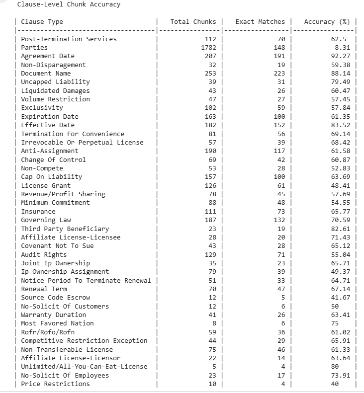
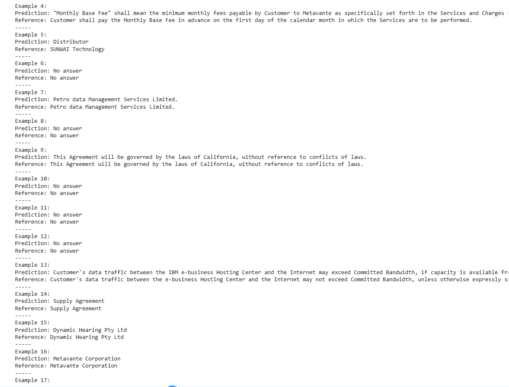
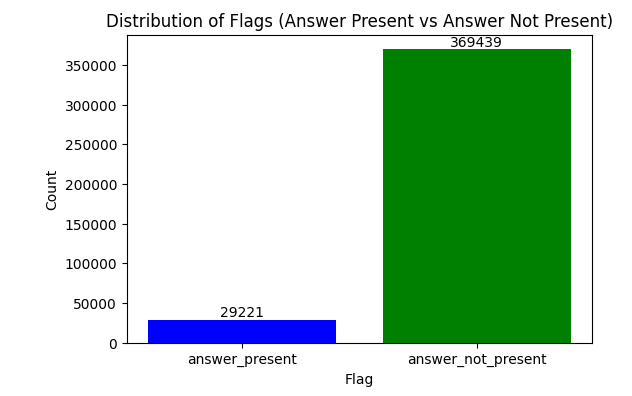
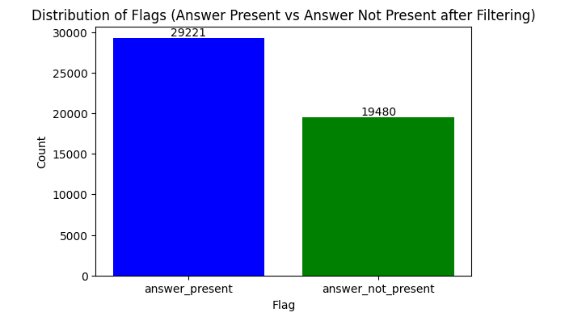
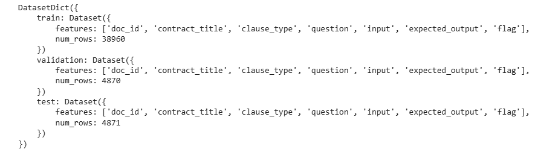
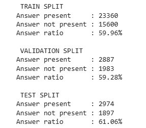

**Distribution of Unbalance Dataset After Chunking**

**Distribution of Final Dataset After a 40% Downsample of `answer_not_present` flags**
# Architecture & Infrastructure

## System Overview
- How does your pipeline flow (data ingest → preprocess → modeling → deployment)?  

## Tools & Platforms
- Cloud/storage (e.g., AWS, GCP, Azure).  
- Processing (e.g., Spark, Dask, pandas).  
- Training environment (local, cloud instances, GPUs).  

# Future Work

## IMAGES
### Chunk level aggregation BART FUSIONS

### Example predictions FLAN 5

**Chunk-level Accuracy by Clause Type**

------
The final dataset was split into 80% training (38,960 examples), 10% validation (4,870 examples), and 10% test (4,871 examples), using a fixed random seed to ensure reproducibility.

# Tools & Technologies
### Infrastructure
- (e.g., AWS S3, GCP BigQuery, on-prem servers).  

### Data Processing
- (e.g., pandas, numpy, Spark, Dask).  

### Modeling
- (e.g., scikit-learn, TensorFlow, PyTorch, XGBoost, LightGBM).  

### Workflow & Automation
- (e.g., Jupyter, MLflow, Airflow, Docker).  

### Visualization
- (e.g., matplotlib, seaborn, Plotly).  

### Collaboration & Version Control
- (e.g., Git/GitHub, DVC).  

---